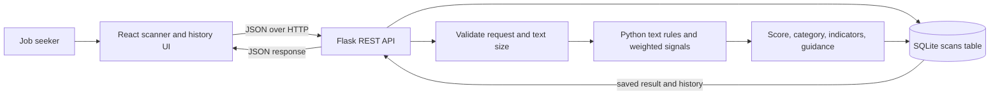

# JobShield System Reference

This file is the detailed working reference for the JobShield prototype. It describes the implementation in this repository: how the interface, API, detection rules, and database fit together; how to run them; and which capabilities are still planned. Product and security boundaries are called out so that prototype behavior is not mistaken for production capability.

## 1. Product purpose

JobShield gives job seekers a first-pass review of a job posting or recruiter message. It searches the submitted text for common recruitment-scam clues, assigns a rule-based risk score, explains the matching clues, and offers independent verification steps.

The result is an assessment of text patterns. The system does not establish the identity of an employer, validate a job opening, or prove that a message is genuine. A lower-risk assessment is not a guarantee of safety.

## 2. Current implementation at a glance

| Layer | Implementation | Responsibility |
| --- | --- | --- |
| Web client | React 19, JavaScript, Vite 7, CSS | Text entry, scan request, result presentation, local history view, feedback controls |
| API | Python 3, Flask, Flask-CORS | Validate requests, call the detector, persist scans, expose history and feedback |
| Detection | Hand-authored Python rules in `backend/app/detector.py` | Match text patterns, add signal weights, choose a risk band, return explanations and guidance |
| Database | SQLite through Python's `sqlite3` module | Store scan text, computed result, timestamp, and feedback |
| API exploration | Postman collection | Exercise the implemented JSON endpoints |

The repository does not currently include a trained scikit-learn model, training corpus, account system, JWT authentication, external employer lookup, or production deployment setup. See [Section 12](#12-boundaries-and-future-work).

## 3. Repository map

```text
JobShield/
├── backend/
│   ├── app/
│   │   ├── __init__.py       Flask app factory, routes, SQLite setup
│   │   └── detector.py       Rule definitions and assessment logic
│   ├── run.py                Local API entry point
│   └── requirements.txt      Flask and Flask-CORS dependencies
├── frontend/
│   ├── index.html            Browser document and Vite entry point
│   ├── package.json          React and Vite scripts/dependencies
│   └── src/
│       ├── main.jsx          React UI, state, API calls, result/history views
│       └── styles.css        Layout, visual system, and responsive behavior
├── ml/
│   └── README.md             Future data and model evaluation guidance
├── docs/
│   ├── PRD.md                Product behavior and prototype scope
│   ├── TRD.md                Implemented stack and planned production work
│   ├── architecture.md       Component/request-flow overview
│   └── implementation-plan.md Delivered scope and next engineering steps
├── postman/
│   ├── JobShield.postman_collection.json
│   └── README.md
├── .env.example              Example environment settings
├── .gitignore
├── README.md                 Project landing page and quick start
└── brain.md                  This detailed system reference
```

At runtime, the API creates `backend/instance/jobshield.db` unless `JOBSHIELD_DATABASE` points to a different path. The generated database is ignored by Git (`*.db`).

## 4. Architecture



The browser and API are separate processes. During local development, Vite serves the React application at port `5173` and Flask listens on `127.0.0.1:5000`. The browser sends requests to the API base URL configured in `VITE_API_BASE_URL` (default `http://localhost:5000/api`). Flask-CORS permits `http://localhost:5173` and `http://127.0.0.1:5173` by default.

### Component responsibilities

**React client (`frontend/src/main.jsx`)**

- Keeps the current page, textarea contents, assessment, recent scans, request state, error message, API connection state, and feedback state in React state.
- Sends JSON requests to the Flask API and renders response data.
- Does not calculate the risk score in the browser.
- Loads the recent-scan list on startup and after an analysis.

**Flask API (`backend/app/__init__.py`)**

- Builds the application through `create_app()`.
- Creates the SQLite schema when the app starts and opens one connection per Flask request context.
- Validates JSON and text size before calling `analyze_text()`.
- Saves the result and provides history and feedback endpoints.
- Uses parameterized SQL values for user-provided data.

**Detector (`backend/app/detector.py`)**

- Normalizes repeated whitespace.
- Evaluates text against explicit regular-expression rules and a link-domain check.
- Emits one indicator for each matching rule, accumulates weights, applies the score cap and category thresholds, then assembles guidance.
- Does not make network requests or consult an external dataset/model.

**SQLite**

- Persists scan text because the history view can reopen prior assessments.
- Persists the serialized assessment returned by the detector.
- Has no user/account ownership field, automatic expiration, or multi-tenant isolation.

## 5. End-to-end user flows

### First page load

1. The browser renders the scanner page with an empty textarea and an explanatory empty-results panel.
2. React calls `GET /api/history` to populate recent scans and determine whether the API is reachable.
3. A successful history response marks the API as connected. A failed request marks it unavailable; the interface remains open and displays the offline state.

### Analyze a posting

1. The user pastes a job post or recruiter message, or loads the included sample.
2. The browser counts characters and enables the Analyze button for non-empty text. On submit, the client requires at least 25 characters.
3. React sends `POST /api/analyze` with a JSON `text` property and shows a busy state.
4. Flask checks that the body is a JSON object, that `text` is a non-empty string, and that it is no longer than 50,000 characters. Flask also limits the whole request body to 64 KB.
5. The detector returns a score, category, summary, indicators, guidance, checked-signal labels, and a model limitation note.
6. Flask timestamps and saves the scan in SQLite. It responds with HTTP 201 and adds the new scan ID and timestamp to the response.
7. React renders the score, category, explanation list, safety guidance, and feedback buttons. It refreshes the recent history list.

### Revisit history

1. The user opens Scan history from the sidebar or View history shortcut.
2. The API returns up to 30 scans, newest first, with text, stored assessment, timestamp, and feedback.
3. Selecting a history row returns to the scanner, fills the text area, and shows the stored assessment without recalculating it.
4. Clear history sends `DELETE /api/history`. The API deletes all rows from the local scans table.

### Send feedback

1. On an assessment, the user selects Yes or No.
2. React posts the scan ID and either `helpful` or `not_helpful` to `/api/feedback`.
3. The API updates that scan's feedback column. Feedback is stored but is not currently used to train a model or change risk scores.

## 6. User interface and behavior

### Scanner view

- **Sidebar:** JobShield mark, Risk scanner and Scan history navigation, safety note, and API status.
- **Top bar:** Current view breadcrumb, prototype label, and initials avatar (decorative; there is no signed-in user).
- **Intro:** Frames the feature as a first review and sets user expectations.
- **Input card:** Text area, Try sample action, character count, privacy/storage note, and Analyze posting action.
- **Signal strip:** Lists broad signal groups the prototype looks for.
- **Results panel:** Initially explains what will appear. After a scan, shows score, category, summary, indicators, guidance, model note, and feedback.
- **Mini stats:** Counts the history records currently loaded (the API returns at most 30), and those not in the Lower risk category.
- **Disclaimer:** Reminds the user that a low score is not proof of legitimacy.

### History view

- Lists up to 30 recent scans with category, text excerpt, numeric score, and date.
- Clicking a row reopens its text and saved result on the scanner page.
- Offers Clear history and an empty state when there are no scans.

### Visual and responsive behavior

The visual system uses a muted light workspace, white cards, restrained teal accents, small borders, and low-contrast shadows. It does not rely on a remote icon or font service. CSS breakpoints at `1100px`, `820px`, and `540px` adjust page padding, collapse the sidebar to icon navigation, stack the analysis columns, and adapt the history layout for narrow screens.

### Client state and API status

The client stores the current text, result, history array, busy flag, error text, API status, page choice, and current feedback in React state. API status is determined by loading `/history`; the UI does not separately call `/health` on page load. Page navigation is state-based and does not use a routing library.

## 7. Detection and scoring details

### Current signal rules

Each rule can add at most one finding per scan, regardless of how many times its pattern appears. Matching is case-insensitive. Whitespace is collapsed before the rule checks.

| Signal ID | Weight | Displayed finding | Pattern intent |
| --- | ---: | --- | --- |
| `payment` | 34 | Upfront payment | Application/registration/processing/training/equipment/background-check/security fee, charge, or payment; direct request to pay/send a fee, money, or deposit; or crypto/bitcoin/gift-card payment language |
| `sensitive_data` | 30 | Sensitive information requested early | Mentions bank account, routing number, Social Security, passport number, national ID, tax ID, or credit card |
| `unrealistic_pay` | 19 | Unusually high pay promise | Matches specified high hourly pay, $4,000+ day/week pay, or certain pay-per-hour claims close to “no experience” language |
| `urgency` | 14 | Pressure to act immediately | Phrases such as “act now”, “immediately”, “limited slots”, “today only”, “urgent”, and “respond immediately” |
| `off_platform` | 14 | Conversation moved to an informal channel | Mentions Telegram, WhatsApp, Signal, text/DM, or messaging on another channel |
| `personal_email` | 14 | Personal email used for recruiting | Email at Gmail, Yahoo, Outlook, Hotmail, or ProtonMail domains |
| `check_deposit` | 38 | Check deposit or money transfer mentioned | Check/cheque appears near deposit/cash/mobile-deposit language or a request to send/forward/transfer/return it |
| `vague_company` | 12 | Company identity is unclear | Phrases such as confidential employer, undisclosed client, or company name to be revealed later |
| `suspicious_link` | 11 | Link uses a higher-risk domain ending | URL host ends in `.top`, `.xyz`, `.click`, `.work`, `.tk`, or `.buzz` |
| `limited_context` | 11 | Little verifiable role information | Text is under 500 characters and contains none of the configured role/detail words (job title, position, role, responsibility stem, experience, qualification, requirements) |

The URL check finds `http(s)://` and `www.` strings, trims common trailing punctuation, extracts the host with Python's `urlparse`, and checks the listed endings. It does not visit or reputation-check the link.

### Score and labels

1. Add the weight of each matching indicator.
2. Limit the total score to `99` (the UI presents it out of 100).
3. Assign a category using these cutoffs:
   - `0–24`: `low_risk` / **Lower risk**
   - `25–59`: `suspicious` / **Suspicious**
   - `60–99`: `high_risk` / **High risk**
4. A detector finding is marked `high` severity when its weight is 30 or more, `medium` for other named rules, and `low` for limited context.

The score is a hand-authored heuristic total, not a probability, calibrated confidence, or model score. The weights and thresholds have not been validated against a labeled dataset.

### Returned assessment fields

- `score`: integer score, capped at 99.
- `category`: stable category code (`low_risk`, `suspicious`, or `high_risk`).
- `label`: human-readable risk category.
- `summary`: category-specific short explanation.
- `indicators`: array of `{ id, title, detail, severity }` objects.
- `guidance`: practical verification steps; payment/check and sensitive-data findings add tailored warnings.
- `signals_checked`: broad static labels for the UI/API consumer; it does not list every internal rule ID.
- `model_note`: clarifies that this is rule-based and cannot verify identity.

## 8. HTTP API reference

Default base URL: `http://localhost:5000/api`. Responses are JSON. There is no authentication or per-user data boundary.

### `GET /health`

Returns API status and project name:

```json
{"status":"ok","project":"JobShield"}
```

### `POST /analyze`

Request:

```json
{"text":"The full job post or recruiter message"}
```

Success: HTTP `201`; returns the assessment fields plus `id` and ISO-8601 `created_at`.

Errors: HTTP `400` for a missing/non-object JSON body, a missing/non-string `text`, or blank text; HTTP `413` if the text exceeds 50,000 characters or the whole request exceeds Flask's 64 KB limit.

### `GET /history`

Returns `{ "items": [...] }` with at most 30 records ordered newest first. Each item contains `id`, the submitted `text`, `category`, `score`, `created_at`, `feedback`, and a `result` object with the stored assessment. Scan text is included in the response so the UI can reopen scans.

### `DELETE /history`

Deletes all records from the scans table and returns `{ "status": "cleared" }`.

### `POST /feedback`

Request:

```json
{"scan_id":1,"value":"helpful"}
```

`value` must be `helpful` or `not_helpful`. Returns `{ "status": "saved" }` on success, HTTP `400` for invalid feedback, and HTTP `404` when the scan ID does not exist.

## 9. Data model and persistence

The app creates this table during startup if it does not already exist:

| Column | Type | Meaning |
| --- | --- | --- |
| `id` | `INTEGER PRIMARY KEY AUTOINCREMENT` | Scan identifier |
| `text` | `TEXT NOT NULL` | Original submitted posting/message |
| `category` | `TEXT NOT NULL` | Rule-engine category code |
| `score` | `INTEGER NOT NULL` | Computed rule score |
| `result_json` | `TEXT NOT NULL` | Serialized detector response before scan ID and timestamp are added to the HTTP response |
| `created_at` | `TEXT NOT NULL` | UTC ISO-8601 timestamp |
| `feedback` | `TEXT` | `helpful`, `not_helpful`, or null |

The default file path is resolved from the backend package as `backend/instance/jobshield.db`. `JOBSHIELD_DATABASE` overrides this path; when set to a relative path, it is resolved relative to the process working directory. The database is opened lazily per Flask request and closed at teardown. There is no automatic cleanup or retention limit; the history endpoint only limits how many items it returns.

## 10. Local development

### Requirements

- Python 3.10 or newer.
- Node.js 20.19+ or 22.12+ for Vite 7.
- npm (included with Node.js).

### Start Flask on Windows PowerShell

```powershell
cd backend
python -m venv .venv
.\.venv\Scripts\Activate.ps1
pip install -r requirements.txt
python run.py
```

The runner binds to `127.0.0.1:5000` with Flask debug mode disabled.

### Start the React app

In a second terminal from the repository root:

```powershell
cd frontend
npm install
npm run dev
```

Open the Vite URL printed by the dev server, usually `http://localhost:5173`.

### Environment settings

| Variable | Used by | Default / example | Purpose |
| --- | --- | --- | --- |
| `VITE_API_BASE_URL` | Frontend build/dev server | `http://localhost:5000/api` | Flask API base URL |
| `CORS_ORIGINS` | Flask process | `http://localhost:5173,http://127.0.0.1:5173` | Comma-separated browser origins accepted by Flask-CORS |
| `JOBSHIELD_DATABASE` | Flask process | unset (backend `instance` path) | SQLite database file path |

The project does not automatically load `.env.example`. Export variables in the shell or place frontend variables in `frontend/.env.local` for Vite.

## 11. Postman collection

Import `postman/JobShield.postman_collection.json`. It defines a `baseUrl` collection variable (`http://localhost:5000`) and requests for Health, Analyze a posting, Recent history, Submit feedback, and Clear local history. A successful Analyze request stores the returned scan ID in the `scanId` collection variable for the feedback request.

## 12. Boundaries and future work

### Not implemented

- User registration, login, JWT issuance, JWT validation, and user-owned scan history.
- A training dataset, fitted scikit-learn model, or validated NLP classifier.
- Company-domain verification, job-board integrations, URL fetching/reputation checks, or external intelligence.
- Production database, secrets, deployment manifests, observability, or rate limiting.
- Per-user retention controls. Clearing history removes all scans in this prototype database.

### Recommended next steps

1. Decide account, privacy, and retention requirements before storing real postings or personal data.
2. Add authentication and authorize every history, feedback, and deletion operation by account.
3. Curate a documented, representative, privacy-reviewed labeled dataset.
4. Measure rule/model precision, recall, false-positive rates, class balance, and source/time leakage.
5. Compare a scikit-learn baseline to the current rules and preserve human-readable explanations.
6. Add request limits, rate limiting, HTTPS, secret handling, logging/monitoring, and deployment configuration.
7. Host the frontend separately from a Flask API and persistent database; Vercel alone is not the API/database deployment plan.

## 13. Source of truth

When implementation details change, update this file and the quick-start README in the same change. The code remains authoritative for current runtime behavior; the separate documents provide shorter product (`docs/PRD.md`), architecture (`docs/architecture.md`), technical (`docs/TRD.md`), and delivery-plan (`docs/implementation-plan.md`) views.
